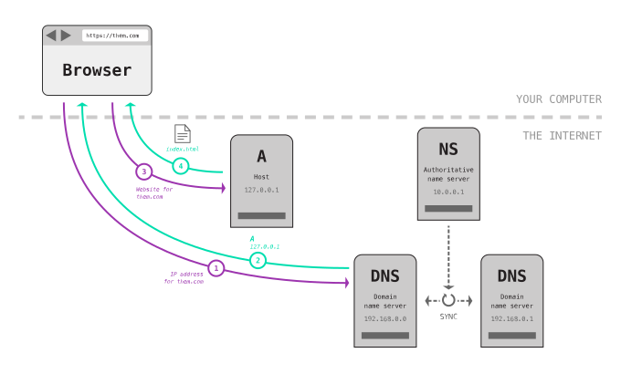

# Domains & DNS

A quick overview of how the Web works, how the DNS works, and how our computers access and download websites.

---

## Domains vs. IPs

- We use domains to access websites — but computers need IP addresses
- IP addresses are confusing for humans

IPv4 — `127.0.0.1`  IPv6 — `2001:0db8:85a3:0000:0000:8a2e:0370:7334`

---

## DNS

(Domain Name System)

Maps Domains ⬌ IPs

---

## DNS records

Each registered domain has a bunch of information attached to it—here’s some important entries:

- `NS` — The authoritative DNS information server
- `A` — The domain to IP mapping for the host
- `MX` — The email server location
- `CNAME` — A subdomain or alias for the A record

---

## Website lookup process

0. You type a domain into your browser—your computer needs the IP
1. It contacts a DNS server asking for the the IP address of a domain
2. The DNS returns the IP address to your computer (or forwards your computer to another DNS server)
3. Your computer contacts the server located at the IP address directly and asks for the domain
4. That server responds with an HTML page (or redirects your computer to another server)
5. That HTML page triggers the browser render, downloads all the CSS, images, etc.

---

## Leasing domains

- Leasing a domain registers it in the DNS
- And points the domain to an IP address — the host
- Also points to where email is sent and received

_Domain leases are not permanent—if you don’t renew on time you will lose the domain to a squatter._

---

## Don’t buy everything in one place

_Don’t buy your hosting, email & domains all from the same place!_

- It may be convenient to start but will get really annoying
- Difficulty switching — if you want to change host, well, now you likely have to change all services
- Security — if one is compromised they all are
